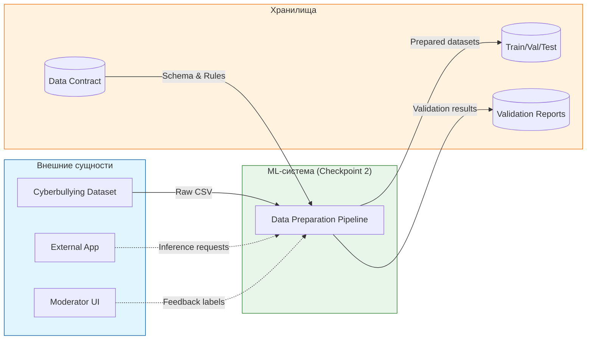

```mermaid

flowchart LR
    subgraph External ["Внешние сущности"]
        Dataset[Cyberbullying Dataset]
        App[External App]
        ModUI[Moderator UI]
    end
    
    subgraph System ["ML-система (Checkpoint 2)"]
        Pipeline[Data Preparation Pipeline]
    end
    
    subgraph Storage ["Хранилища"]
        TrainSet[(Train/Val/Test)]
        Contract[(Data Contract)]
        Reports[(Validation Reports)]
    end
    
    Dataset -->|Raw CSV| Pipeline
    Contract -->|Schema & Rules| Pipeline
    Pipeline -->|Prepared datasets| TrainSet
    Pipeline -->|Validation results| Reports
    
    App -.->|Inference requests| Pipeline
    ModUI -.->|Feedback labels| Pipeline
    
    style External fill:#e1f5fe,stroke:#01579b
    style System fill:#e8f5e9,stroke:#2e7d32
    style Storage fill:#fff3e0,stroke:#ef6c00
```