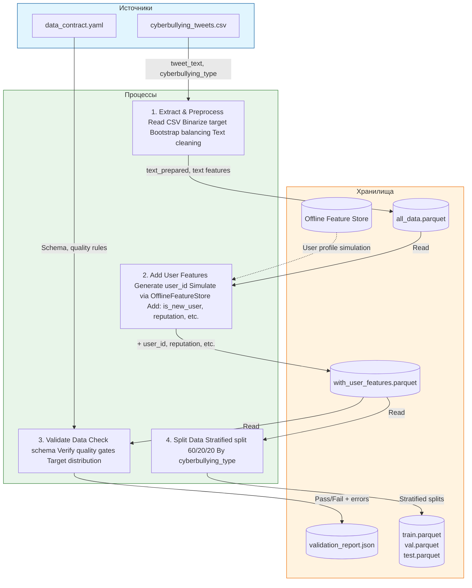

```mermaid

flowchart TB
    subgraph Sources ["Источники"]
        RawCSV["cyberbullying_tweets.csv"]
        Contract["data_contract.yaml"]
    end
    
    subgraph Processes ["Процессы"]
        P1["1. Extract & Preprocess Read CSV Binarize target Bootstrap balancing Text cleaning"]
        P2["2. Add User Features Generate user_id Simulate via OfflineFeatureStore Add: is_new_user, reputation, etc."]
        P3["3. Validate Data Check schema Verify quality gates Target distribution"]
        P4["4. Split Data Stratified split 60/20/20 By cyberbullying_type"]
    end
    
    subgraph Stores ["Хранилища"]
        AllData[("all_data.parquet")]
        WithFeatures[("with_user_features.parquet")]
        ValReport[("validation_report.json")]
        Splits[("train.parquet\nval.parquet\ntest.parquet")]
        FS[("Offline Feature Store")]
    end
    
    %% Потоки
    RawCSV -->|tweet_text, cyberbullying_type| P1
    Contract -->|Schema, quality rules| P3
    
    P1 -->|text_prepared, text features| AllData
    AllData -->|Read| P2
    FS -.->|User profile simulation| P2
    P2 -->|+ user_id, reputation, etc.| WithFeatures
    WithFeatures -->|Read| P3
    P3 -->|Pass/Fail + errors| ValReport
    WithFeatures -->|Read| P4
    P4 -->|Stratified splits| Splits
    
    %% Стили
    style Sources fill:#e1f5fe,stroke:#01579b
    style Processes fill:#e8f5e9,stroke:#2e7d32
    style Stores fill:#fff3e0,stroke:#ef6c00

```