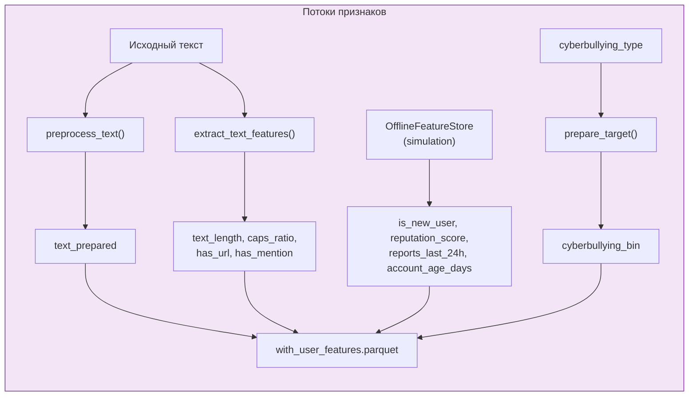

```mermaid

flowchart LR
    subgraph FeatureFlows ["Потоки признаков"]
        direction TB
        
        TextSrc["Исходный текст"] --> TextClean["preprocess_text()"]
        TextClean --> TextPrepared["text_prepared"]
        
        TextSrc --> TextFeat["extract_text_features()"]
        TextFeat --> Derived["text_length, caps_ratio,\nhas_url, has_mention"]
        
        UserSim["OfflineFeatureStore\n(simulation)"] --> UserFeat["is_new_user, reputation_score,\nreports_last_24h, account_age_days"]
        
        Target["cyberbullying_type"] --> Binarize["prepare_target()"]
        Binarize --> BinaryTarget["cyberbullying_bin"]
        
        TextPrepared & Derived & UserFeat & BinaryTarget --> FinalDataset["with_user_features.parquet"]
    end
    
    style FeatureFlows fill:#f3e5f5,stroke:#7b1fa2

```