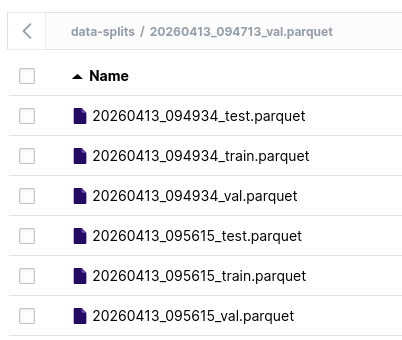
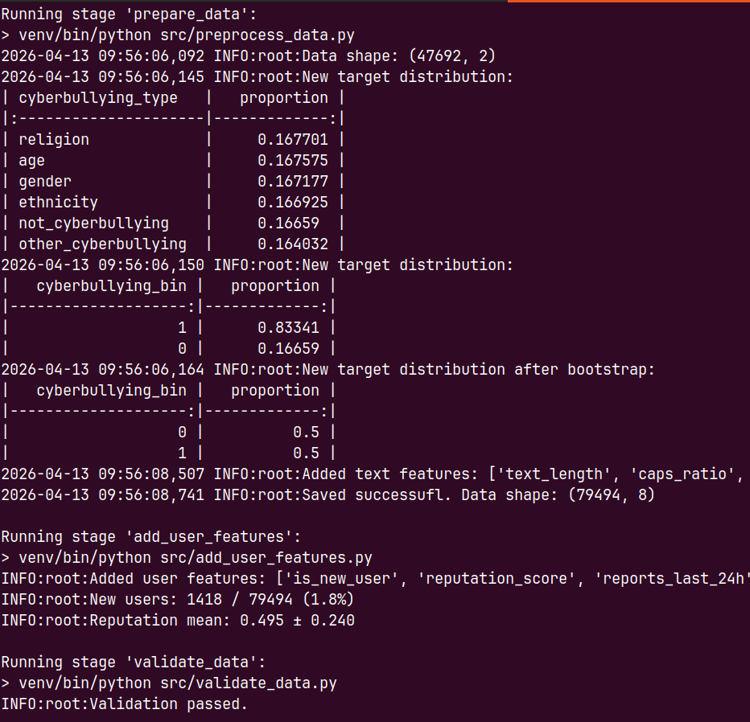

## ЛР№1. Предобработка данных.  

1) В качестве данных выбрали датасет https://www.kaggle.com/datasets/andrewmvd/cyberbullying-classification.  
2) Бинарная классификация текстовых данных. В качестве целевой метрики будем использовать PR-auc. 
Предобработка: очистка текста от лишних символов, удаление упоминаний, ссылок. Добавление фичей по пользователю.  
3) В качестве системы для хранения данных выбрано S3-хранилище `Minio`.  
4) Предобработка реализована через библиотеки `pandas`, `re`.  
5) В качестве инструмента для автоматизации пайплайна выбран DVC. Система разворачивается как локально, так и удаленно. Реализован функционал добавления новых данных.   

  

  
 