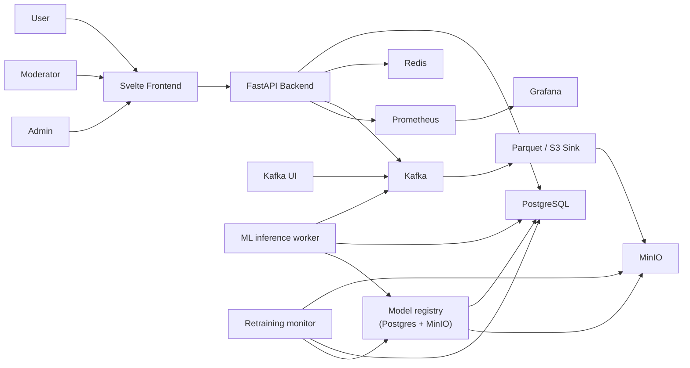
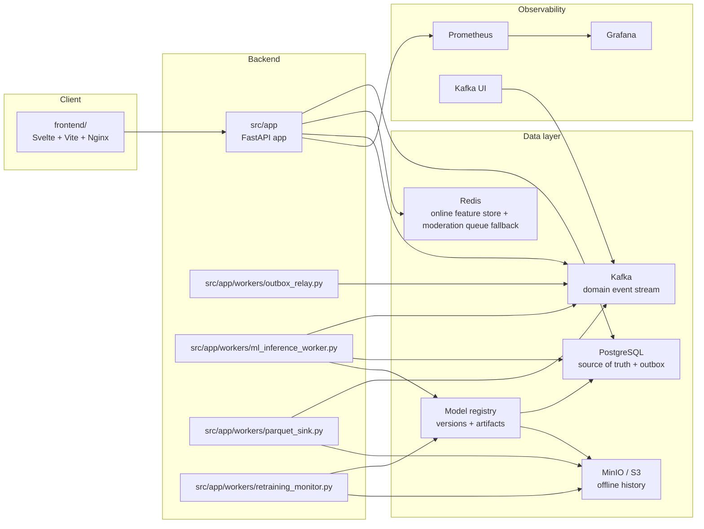
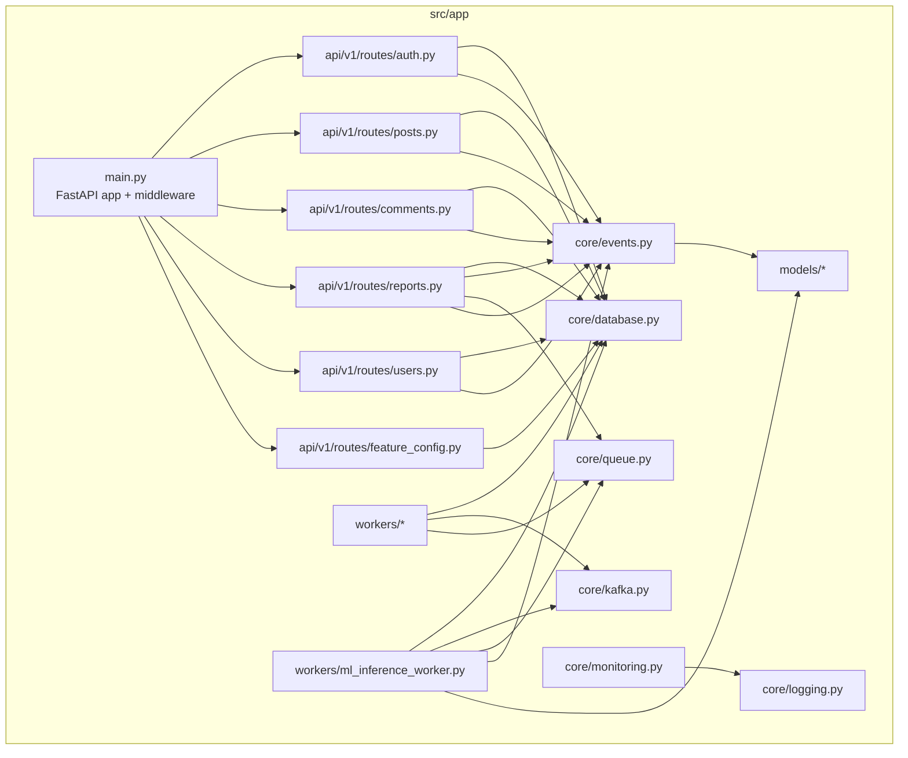

# C4 Architecture

## Context

## Containers

## Backend components

## Key responsibilities

- `PostgreSQL` stores users, posts, comments, reports, and the domain-event outbox.
- `Redis` stores runtime feature config, online feature state, and queue fallback data.
- `Kafka` is the event backbone for domain events.
- `Kafka` also carries moderation ML requests for the inference worker.
- `Retraining monitor` reads parquet archives, computes drift metrics, and launches retraining jobs.
- `Kafka UI` is the local inspection surface for topics and consumer groups.
- `MinIO / S3` is the offline sink for analytics and training data.
- `Model registry` stores versioned model metadata in Postgres and artifacts in MinIO / S3.
