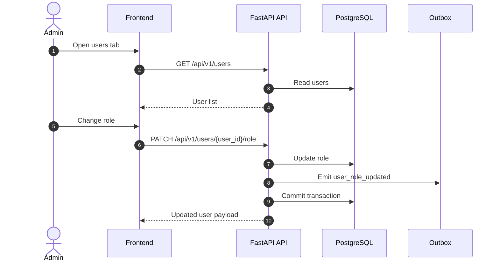
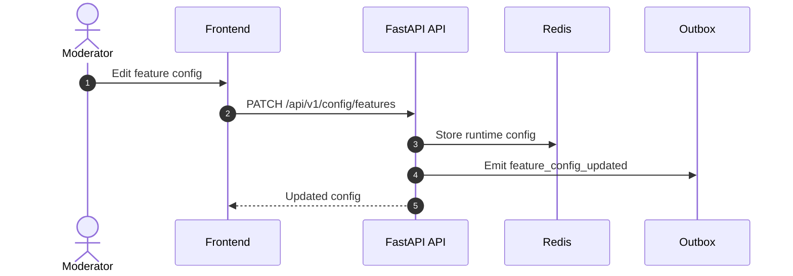

# Admin Flows

## Update user role

```mermaid
sequenceDiagram
  autonumber
  actor Admin
  participant FE as Frontend
  participant API as FastAPI API
  participant DB as PostgreSQL
  participant EVT as Outbox

  Admin->>FE: Open users tab
  FE->>API: GET /api/v1/users
  API->>DB: Read users
  API-->>FE: User list
  Admin->>FE: Change role
  FE->>API: PATCH /api/v1/users/{user_id}/role
  API->>DB: Update role
  API->>EVT: Emit user_role_updated
  API->>DB: Commit transaction
  API-->>FE: Updated user payload
```

## Update feature config

```mermaid
sequenceDiagram
  autonumber
  actor Moderator
  participant FE as Frontend
  participant API as FastAPI API
  participant Redis as Redis
  participant EVT as Outbox

  Moderator->>FE: Edit feature config
  FE->>API: PATCH /api/v1/config/features
  API->>Redis: Store runtime config
  API->>EVT: Emit feature_config_updated
  API-->>FE: Updated config
```

## Notes

- Admin role management is restricted to `admin`.
- Feature config is restricted to `moderator` and `admin`.

