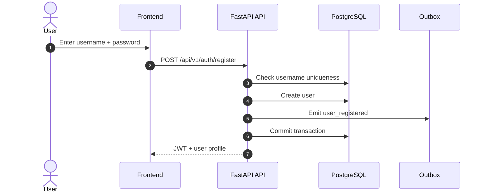
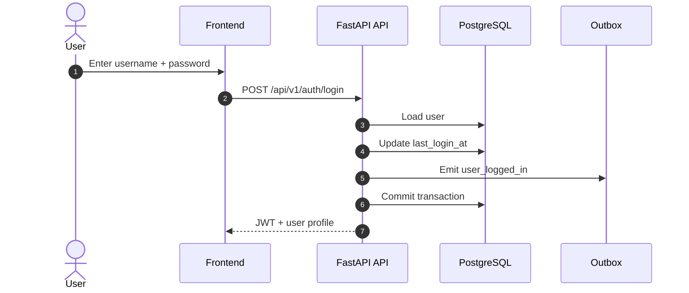

# Authentication Flow

## Register

## Login

## Notes

- The first registered account becomes `admin`.
- All subsequent accounts default to `user`.
- The frontend stores the JWT in local storage and sends `Authorization: Bearer <token>`.

