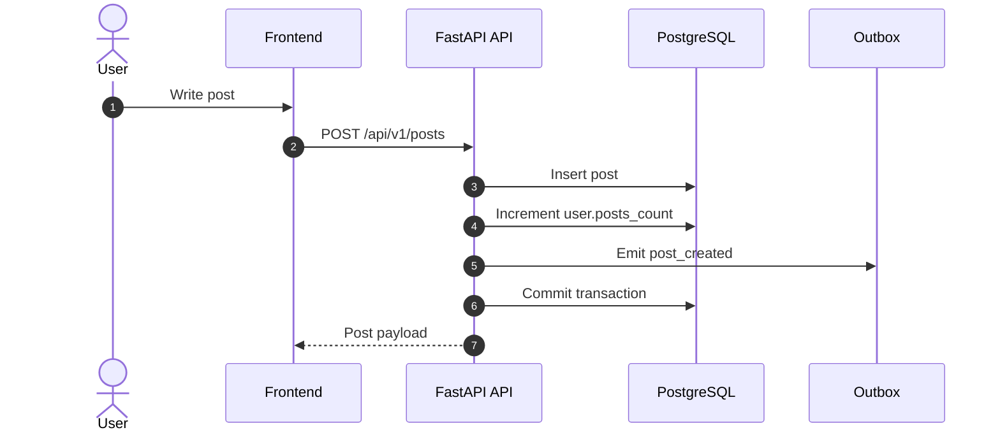
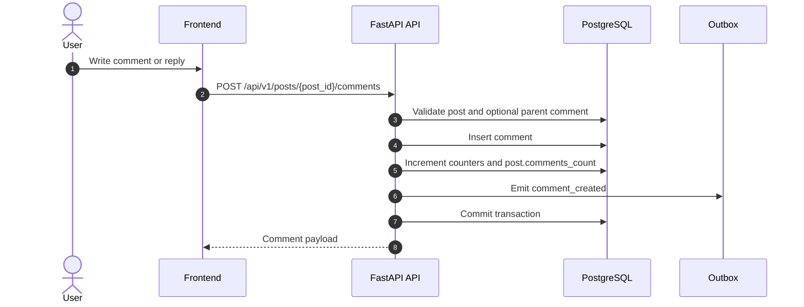
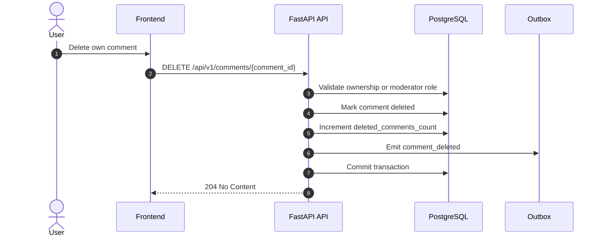
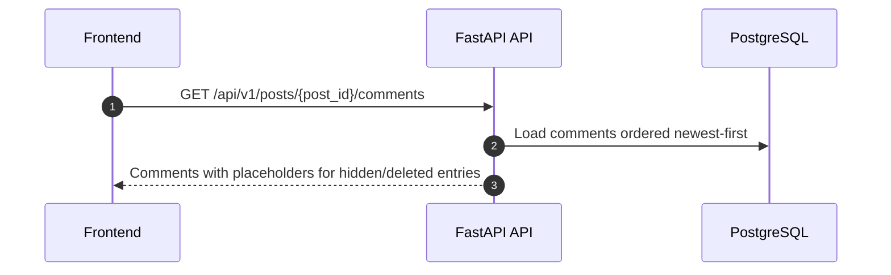

# Content Flow

## Create post

```mermaid
sequenceDiagram
  autonumber
  actor User
  participant FE as Frontend
  participant API as FastAPI API
  participant DB as PostgreSQL
  participant EVT as Outbox

  User->>FE: Write post
  FE->>API: POST /api/v1/posts
  API->>DB: Insert post
  API->>DB: Increment user.posts_count
  API->>EVT: Emit post_created
  API->>DB: Commit transaction
  API-->>FE: Post payload
```

## Create comment / reply

```mermaid
sequenceDiagram
  autonumber
  actor User
  participant FE as Frontend
  participant API as FastAPI API
  participant DB as PostgreSQL
  participant EVT as Outbox

  User->>FE: Write comment or reply
  FE->>API: POST /api/v1/posts/{post_id}/comments
  API->>DB: Validate post and optional parent comment
  API->>DB: Insert comment
  API->>DB: Increment counters and post.comments_count
  API->>EVT: Emit comment_created
  API->>DB: Commit transaction
  API-->>FE: Comment payload
```

## Delete comment

```mermaid
sequenceDiagram
  autonumber
  actor User
  participant FE as Frontend
  participant API as FastAPI API
  participant DB as PostgreSQL
  participant EVT as Outbox

  User->>FE: Delete own comment
  FE->>API: DELETE /api/v1/comments/{comment_id}
  API->>DB: Validate ownership or moderator role
  API->>DB: Mark comment deleted
  API->>DB: Increment deleted_comments_count
  API->>EVT: Emit comment_deleted
  API->>DB: Commit transaction
  API-->>FE: 204 No Content
```

## View comments

```mermaid
sequenceDiagram
  autonumber
  participant FE as Frontend
  participant API as FastAPI API
  participant DB as PostgreSQL

  FE->>API: GET /api/v1/posts/{post_id}/comments
  API->>DB: Load comments ordered newest-first
  API-->>FE: Comments with placeholders for hidden/deleted entries
```

