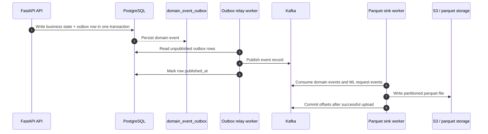
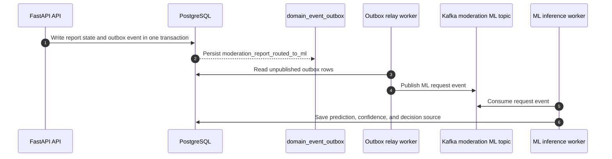
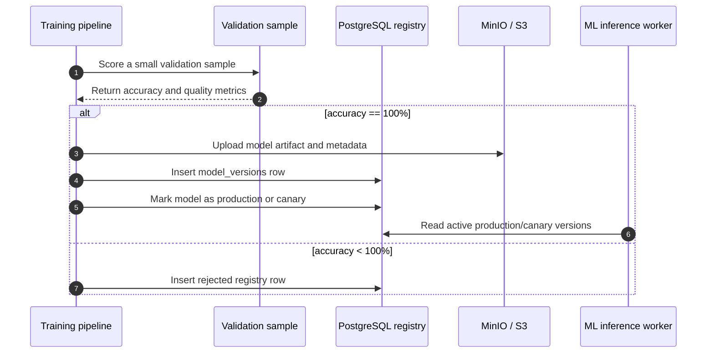
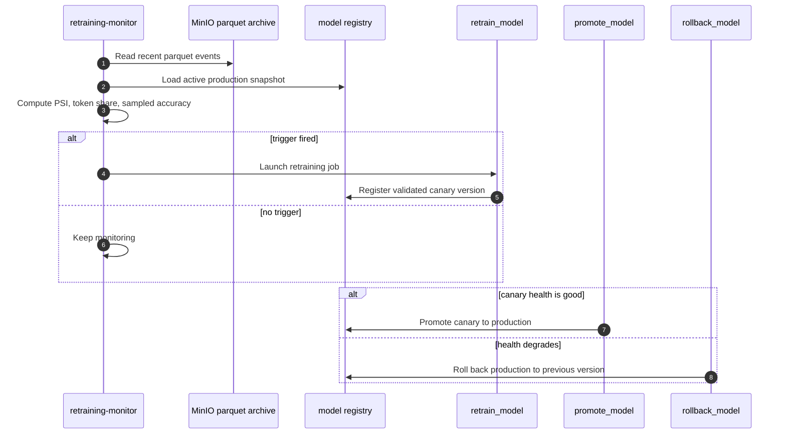

# Event Pipeline

## Outbox to Kafka to parquet

## Moderation ML request path

## Model registry deployment

## Retraining and deployment control

## Design rules

- Business state is written to Postgres first.
- Domain events are persisted in the outbox in the same transaction.
- Kafka is used for replayable event streaming.
- Moderation reports can also be routed to a dedicated ML request topic.
- Parquet is the offline, append-only sink.
- Object storage is the long-term archive for offline analytics and ML retraining.
- The parquet sink commits Kafka offsets only after the object upload succeeds.
- Model registry deployment is blocked unless the sampled validation accuracy reaches 100%.
- Retraining monitor is the drift gate that decides when to launch a new training run.
- Promotion and rollback are explicit registry actions, not automatic side effects of training.
