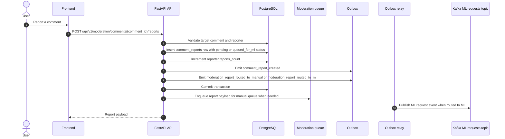
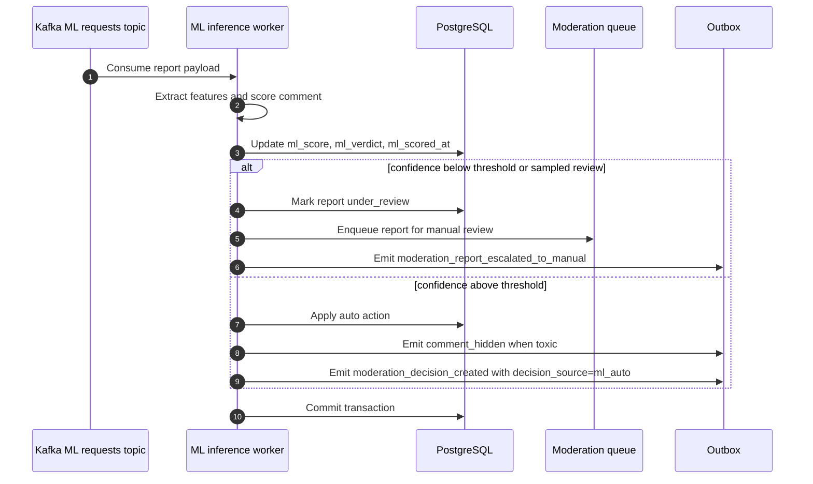
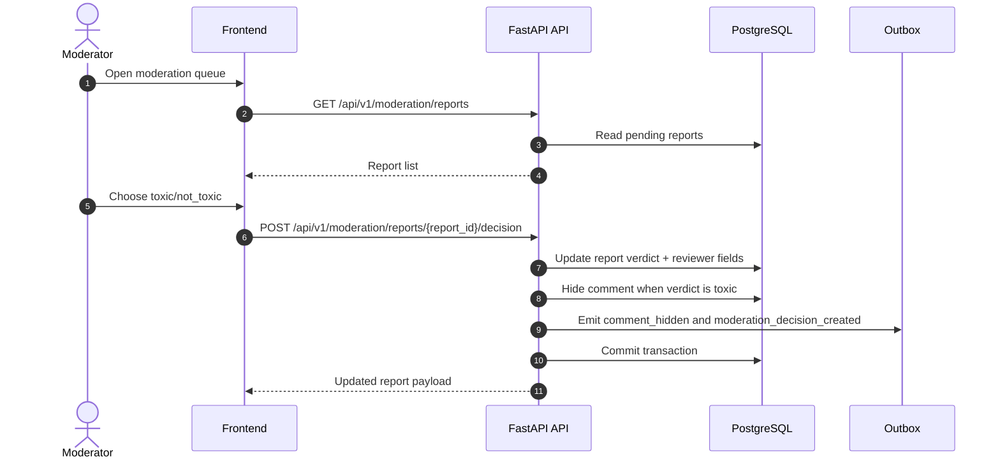

# Moderation Flow

## Report comment

## ML inference and escalation

## Moderator decision

## Notes

- The moderator UI reads the live state from `comment_reports` in Postgres.
- Kafka and the outbox are for downstream processing, ML inference, and replay, not for the live admin screen.
- The ML worker loads versioned artifacts from the model registry and routes 10% of traffic to canary when active.
- The ML worker can auto-resolve high-confidence reports and escalate uncertain or sampled reports to the manual moderation queue.
