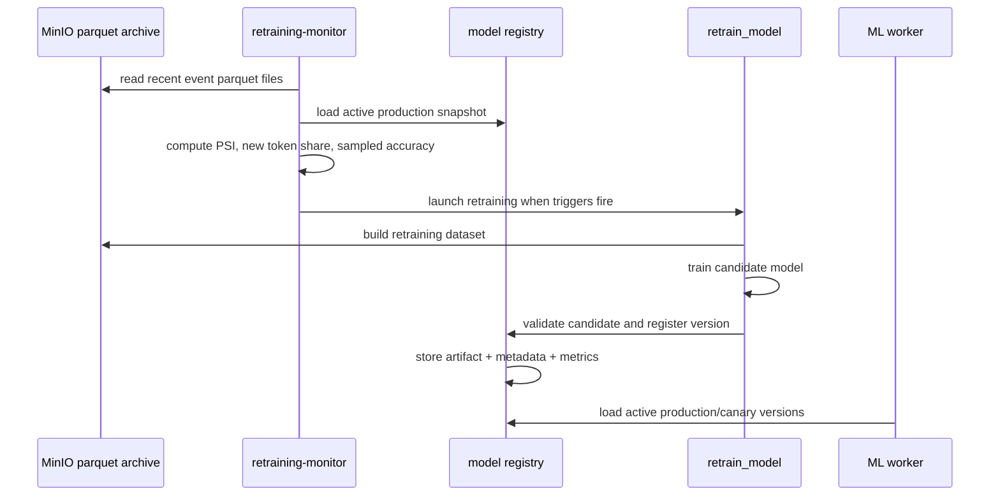

# Retraining Pipeline

## Flow

## Retraining triggers

- PSI breach: a monitored feature crosses `RETRAINING_PSI_THRESHOLD`.
- New token share breach: token share outside baseline vocabulary crosses `RETRAINING_NEW_TOKEN_SHARE_THRESHOLD`.
- Manual sample accuracy drop: sampled manual accuracy falls below `RETRAINING_MANUAL_ACCURACY_THRESHOLD` on at least `RETRAINING_MANUAL_ACCURACY_MIN_SAMPLES` rows.

## Deploy gate

- Candidate is first validated on a small sample from `val.parquet`.
- If sample accuracy is not exactly `1.0`, the deployment is rejected.
- If the gate passes, the version is registered as production or canary depending on registry state.
- Promotion to production is handled by [`src/pipeline/promote_model.py`](../../src/pipeline/promote_model.py).

## Rollback triggers

- Sampled manual accuracy stays below threshold after deployment.
- PSI continues to grow after a retraining cycle.
- Inference latency or error rate increases after the new version is activated.
- Canary sampled accuracy or confidence distribution degrades relative to the active production baseline.
- Manual rollback can be executed with [`src/pipeline/rollback_model.py`](../../src/pipeline/rollback_model.py).

## Registry states

- `candidate` - fresh training output, not yet validated.
- `validated` - offline validation passed.
- `canary` - receives a limited share of live traffic.
- `production` - active serving version.
- `rejected` - validation gate failed.
- `rolled_back` - active version was reverted.
- `archived` - previous active version kept for audit and rollback.
