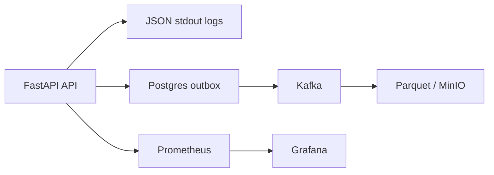

# Logging and Monitoring

## Logging layers

## Conventions

- Every request has a request ID.
- Business actions emit structured domain events.
- Logs should not contain passwords, JWTs, or raw secrets.
- Operational logs are for debugging and incident response.
- Event logs are for audit, replay, analytics, and ML datasets.
- Parquet sink uses manual Kafka commits after successful object storage writes.

## Metrics

- HTTP request count
- HTTP latency
- moderation queue depth
- ML reports routed total
- ML inference total
- ML auto action total
- ML manual escalation total
- ML model stage total
- model registry validation total
- model registry deployment total
- ML confidence histogram
- ML inference latency histogram
- users total
- posts created total
- comments created total
- reports created total
- hidden comments total
- moderation decision latency histogram
- retraining trigger gauges
- model registry deployment counters
- ML worker inference metrics on `http://localhost:8011/metrics`
- retraining monitor metrics on `http://localhost:8012/metrics`

## Monitoring levels

### Data

- PSI for monitored numeric features, computed from `feature_profiles` stored in the active production model's `training_metadata.json`
- new token share against baseline vocabulary from the active production model
- parquet freshness in MinIO

### Model

- confidence distribution
- inference latency
- share of canary traffic
- sampled manual review accuracy

### System

- HTTP request latency and 5xx rate
- moderation queue depth
- ML worker health
- registry validation and deployment counters

## Alerts

Prometheus alert rules are defined in [`src/deploy/prometheus/alerts.yml`](../../src/deploy/prometheus/alerts.yml).

Runbooks for alert handling live in [`docs/runbooks/alerts.md`](../runbooks/alerts.md).

Current alert set:

- data freshness high
- PSI high
- new token share high
- sampled manual accuracy low
- ML inference p95 latency high
- HTTP 5xx rate high
- moderation queue depth high

## Business dashboard

Grafana auto-loads a dashboard named `Arhis Business Metrics` with:

- `arhis_users_total`
- `increase(arhis_posts_created_total[5m])`
- `increase(arhis_comments_created_total[5m])`
- `increase(arhis_reports_created_total[5m])`
- `increase(arhis_comments_hidden_total[5m])`
- `sum(rate(arhis_moderation_decision_latency_seconds_sum[5m])) / sum(rate(arhis_moderation_decision_latency_seconds_count[5m]))`
- `arhis_moderation_queue_depth`
- `increase(arhis_ml_reports_routed_total{route="model"}[5m])`
- `increase(arhis_ml_reports_routed_total{route="manual"}[5m])`
- `increase(arhis_ml_auto_action_total[5m])`
- `increase(arhis_ml_manual_escalation_total[5m])`
- `sum(rate(arhis_ml_model_stage_total{stage="canary"}[5m])) / sum(rate(arhis_ml_model_stage_total[5m]))`
- `sum(increase(arhis_model_registry_validation_total[5m]))`
- `sum(increase(arhis_model_registry_deployment_total[5m]))`
- `sum(rate(arhis_ml_confidence_sum[5m])) / sum(rate(arhis_ml_confidence_count[5m]))`
- `sum(rate(arhis_ml_inference_latency_seconds_sum[5m])) / sum(rate(arhis_ml_inference_latency_seconds_count[5m]))`
- `max(arhis_data_psi{job="arhis-retraining-monitor"})`
- `max(arhis_data_freshness_seconds{job="arhis-retraining-monitor"})`
- `arhis_data_psi` by feature in Prometheus
- `arhis_data_freshness_seconds` in Prometheus
